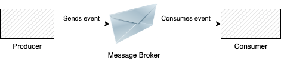

# Deserialization and the Visitor Pattern

## Scenario

Suppose we have two services that communicate with each other through a messaging system.
- Service A is the producer of the message
- Service B is the consumer of the message

Service A sends different messages, let's call them "events" that indicate some simple CRUD operations
on some users.

Service B should receive these messages and perform some operations based on the given events.

The type of events can be:
- create user
- delete user
- update user ....., and the list can go on

The simple architecture of this scenario can be seen in the diagram bellow:




!Note: This scenario is if you are working in a Java based environment, but the same concepts here
could be applied in any statically type language.

### The problem

If all the events illustrated above arrive at the same queue (and they should, they are all related to users events)
How do we go about handling each of the event types.

### Deserializing the events

One solution could be to deserialize the events into a single map, with keys and values.

Example:

```
public class EventDTO {

    private Map<String, Object> data;

    @JsonAnyGetter
    public Map<String, Object> getData() {
        return data;
    }

    @JsonAnySetter
    public void addData(String key, String object) {
        if (this.data == null) {
            this.data = new HashMap<>();
        }

        this.data.put(key, object);
    }
}
``` 

Problems with this approach:
- You don't know what you are getting, and you have to manually perform data validation; you might event end up with events not related to users
- You may end up with a tree like structure, if one of the values of the key contains another object, which will be translated into a map if you are using Jackson for deserialization

Ideally you want to:
- validate the schema of the message, at deserialization time
- have a fixed and well-defined structure of messages you expect (have different dtos for each type of events: create, update, delete...)

## Type based deserialization with Jackson

If you are using Jackson, you can specify the type of object you want to deserialize into, based on a given criteria
This criteria usually is a specific field in the message, that defines which type of event / object it actually is.
In our case, we have the `eventType` which is used as the descriminator.

```
/**
 * We are using jackson to deserialize the events based
 * on the evenType discriminator.
 *
 * Invalid event types are defaulted to GenericEventDTO
 */
@JsonTypeInfo(use = JsonTypeInfo.Id.NAME, include = PROPERTY, property = "eventType", visible = true, defaultImpl = GenericEventDTO.class)
@JsonSubTypes({
        @JsonSubTypes.Type(value = CreateEventDTO.class, name = "CREATE"),
        @JsonSubTypes.Type(value = DeleteEventDTO.class, name = "DELETE"),
        @JsonSubTypes.Type(value = UpdateEventDTO.class, name = "UPDATE"),
})
public abstract class EventDTO {

    protected String eventType;

    public String getEventType() {
        return eventType;
    }

    public void setEventType(String eventType) {
        this.eventType = eventType;
    }
}
```

### Deserialization with type based info

When we deserialize a message , jackson will look for the `eventType` field, and based on its value will deserialize it into one of the following concrete classes:
- CreateEventDTO
- DeleteEventDTO
- UpdateEventDTO

If it doesn't find a value specified in @JsonSubTypes, it will default to the GenericEventDTO
(Full example can be seen in this repo in consumer/src/main/java/example/consumer/dtos)

### The message consumer:

In this example I've build spring service, using spring ampq library to consumer messages from rabbit mq.
The message consumer:

```
/**
 * Consumer of the rabbit mq messages.
 * The messages are deserialized into {@link EventDTO} type instances
 * and are wrapped into a spring event and published.
 */
@Service
public class MessageConsumer {

    private final Logger logger = LoggerFactory.getLogger(getClass());

    private final ObjectMapper objectMapper;

    private final ApplicationEventPublisher applicationEventPublisher;

    public MessageConsumer(ObjectMapper objectMapper, ApplicationEventPublisher applicationEventPublisher) {
        this.objectMapper = objectMapper;
        this.applicationEventPublisher = applicationEventPublisher;
    }

    @RabbitListener(queues = "${message.queueName}")
    public void receive(String message) {

        try {
            EventDTO eventDTO = objectMapper.readValue(message, EventDTO.class);
            applicationEventPublisher.publishEvent(new Event(this, eventDTO));
        } catch (JsonProcessingException e) {
            logger.error("Could not read message from queue.", e);
        }
    }
}
```

As you can see, when you now deserialize the messages using Jackson, the abstract EventDTO
will be resolved into one of the concrete classes specified through the `@JsonSubTypes` annotation.

Here we take the event and publish it with spring's event type publisher, just to decouple the logic of the deserialization
with whateer we want to do with the object next :D, thus we can easily plug in any type of listeners with the help of spring 
and do operations on the events.

## What about the visitor ? You promised ...

First, let's see what we are doing with the messages.
The EventDTO abstract type can be any of CreateEventDTO, DeleteEventDTO... and so on

So what if we want to do operations based on the type of event ? We cast it ... right ?!


```
@Component
public class NoVisitorEventListener {

    private final Logger logger = LoggerFactory.getLogger(getClass());

    private final CreateService createService;

    private final DeleteService deleteService;

    private final UpdateService updateService;

    public NoVisitorEventListener(CreateService createService, DeleteService deleteService, UpdateService updateService) {
        this.createService = createService;
        this.deleteService = deleteService;
        this.updateService = updateService;
    }

  
    @EventListener
    public void handleEvent(Event event) {

        logger.info("Application event received");

        EventDTO eventDTO = event.getEventDTO();

        String eventType = eventDTO.getEventType();

        if ("CREATE".equals(eventType)) {
            UpdateEventDTO updateEventDTO = (UpdateEventDTO) eventDTO;
            updateService.updateUser(
                    updateEventDTO.getUserId(),
                    updateEventDTO.getNewUsername(),
                    updateEventDTO.getNewAddress()
            );
        }

        if ("DELETE".equals(eventType)) {
            DeleteEventDTO deleteEventDTO = (DeleteEventDTO) eventDTO;
            deleteService.deleteUser(deleteEventDTO.getUserId());
        }

        if ("UPDATE".equals(eventType)) {
            CreateEventDTO createEventDTO = (CreateEventDTO) eventDTO;
            createService.createUser(
                    createEventDTO.getUsername(),
                    createEventDTO.getAddress()
            );
        }
    }
}
```

Here we want to do different operations that reside in different services, based on the information
given in the event object. Note, that the only thing in common for each object is the eventType, all other fields
are 

I remember on one of my first jobs as a software developer, a senior engineer told me : 
"If you have to use instanceof, it means that there is something very wrong in the design of your system"

It sticked with me...

Although sometimes we are forced to use instanceof, we should avoid it as much as possible.

### Solving the issue with the visitor pattern

A short recap on visitor...

What it tries to solve:
- Perform distinct, unrelated operations on heterogenous (fancy way of saying they have an origin but differ in certain aspects)
- Avoid querying each type of object, and perform casts on the object pointer.

It seems like a match made in heaven, so let's see how the visitor pattern resolve this:

### The visitor

```
public interface EventVisitor {

    void visit(DeleteEventDTO deleteEventDTO);

    void visit(CreateEventDTO createEventDTO);

    void visit(UpdateEventDTO updateEventDTO);

    void visit(GenericEventDTO genericEventDTO);
}
```

### The EventDTO accepting a EventVisitor type

```
public abstract class EventDTO {

    protected String eventType;

    public String getEventType() {
        return eventType;
    }

    public void setEventType(String eventType) {
        this.eventType = eventType;
    }

    @JsonIgnore
    public abstract void accept(EventVisitor eventVisitor);
}

```

### The concrete implementation of the EventDTO resolving the visit method by its type:

```
public class DeleteEventDTO extends EventDTO {

    private String userId;

    public String getUserId() {
        return userId;
    }

    public void setUserId(String userId) {
        this.userId = userId;
    }

    @Override
    public String toString() {
        return "DeleteEventDTO{" +
                "userId='" + userId + '\'' +
                ", eventType='" + eventType + '\'' +
                '}';
    }

    @Override
    public void accept(EventVisitor eventVisitor) {
        eventVisitor.visit(this);
    }
}
```

### The visitor implementation

```
@Component
public class ServiceEventVisitor implements EventVisitor {

    private final Logger logger = LoggerFactory.getLogger(getClass());

    private final CreateService createService;

    private final DeleteService deleteService;

    private final UpdateService updateService;

    public ServiceEventVisitor(CreateService createService, DeleteService deleteService, UpdateService updateService) {
        this.createService = createService;
        this.deleteService = deleteService;
        this.updateService = updateService;
    }

    @Override
    public void visit(DeleteEventDTO deleteEventDTO) {
        deleteService.deleteUser(deleteEventDTO.getUserId());
    }

    @Override
    public void visit(CreateEventDTO createEventDTO) {
        createService.createUser(createEventDTO.getUsername(), createEventDTO.getAddress());
    }

    @Override
    public void visit(UpdateEventDTO updateEventDTO) {
        updateService.updateUser(
                updateEventDTO.getUserId(),
                updateEventDTO.getNewUsername(),
                updateEventDTO.getNewAddress()
        );
    }

    @Override
    public void visit(GenericEventDTO genericEventDTO) {
        logger.info("Generic object received. No actions to be done here... {}", genericEventDTO);
    }
}
```

### Conclusions

As we can see from the example bellow we solved a number of issues:
- We used Jackson to deserialize the message into concrete types, based on a given criteria
- We used the Visitor pattern, not only to get rid of dynamic casting, but also, we can now add any type of visitors we want,
in order to perform different type of operations on the given set of objects:
    - In the example above we only showd some services performing operations
    - We could also have let's say an Audit type visitor, that audits these events
    - We could have another one that further sends these vents to other messaging systems
    - The list could go on and on ...
    
    
### Running the example project:

If you want to play around...
- I've created dockerfiles for each project
- Created a docker compose file if you want to run them all and test them
- I've exposed a REST endpoint `POST /produce` on the `producer` service and you can post the json message and then watch the logs on the consumer.

Enjoy !

